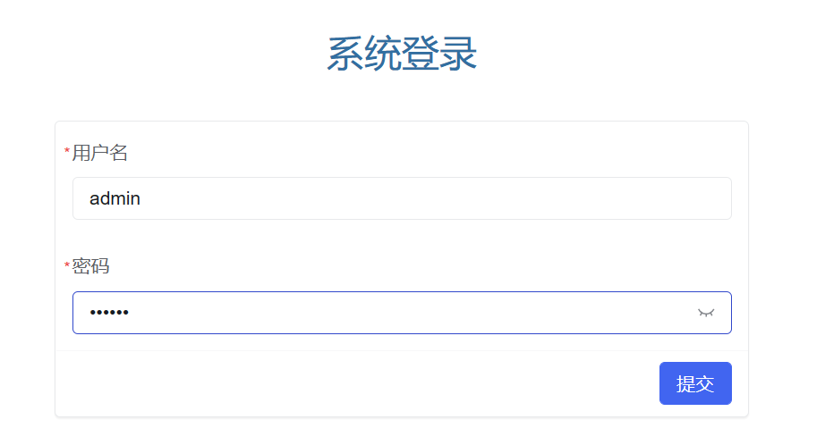
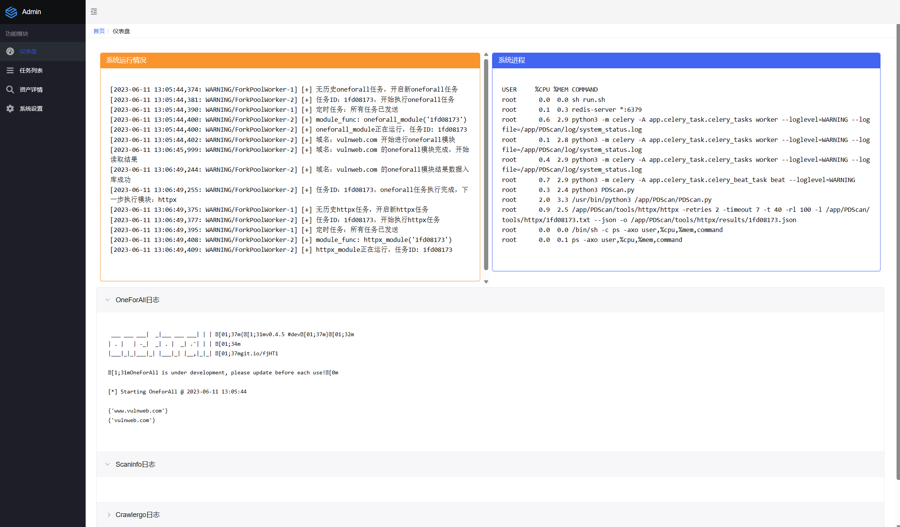
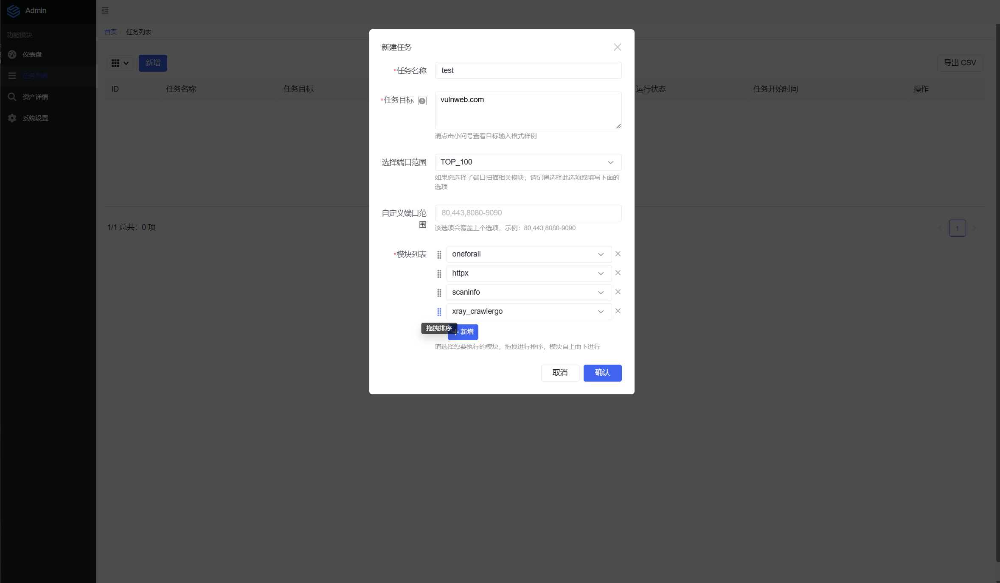
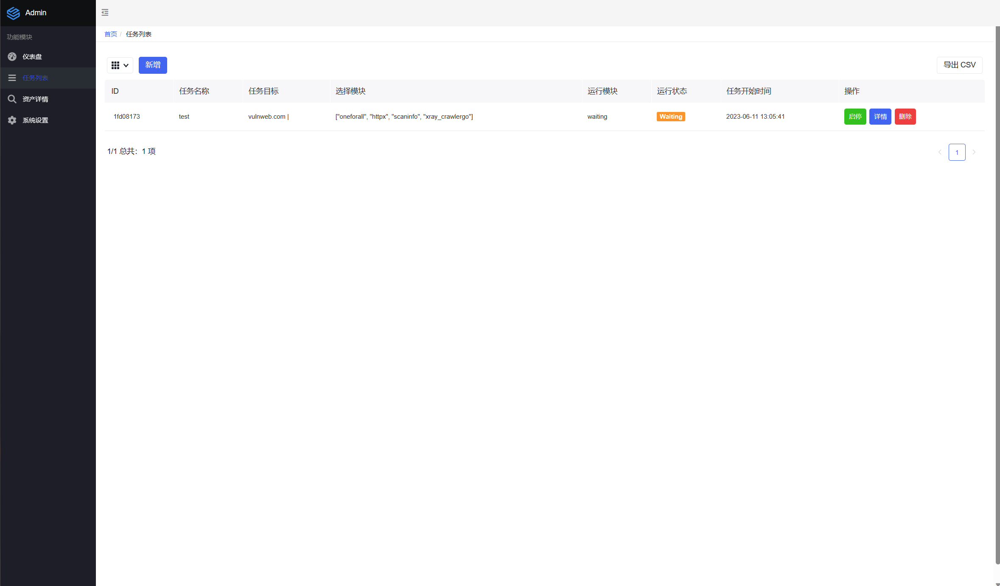
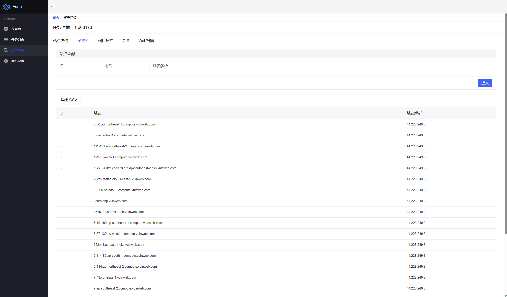
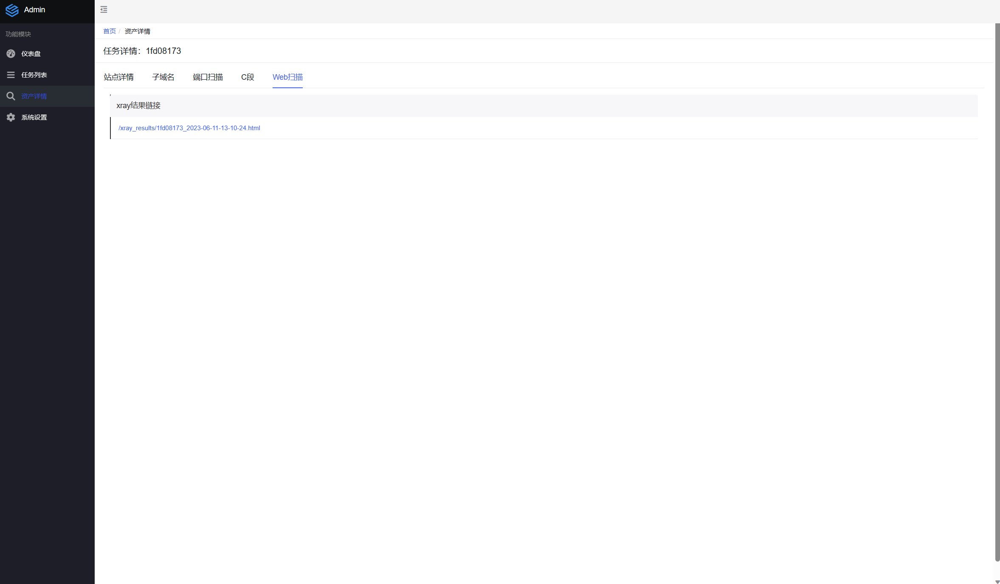

# PDScan

自动化资产搜集+漏扫平台

纯纯的胶水平台，借用了各个大师傅的优秀工具，完成了子域名查询（oneforall），ip端口扫描（scaninfo)，web站点存活探测（httpx），爬虫+漏扫（crawlergo+xray）的工作。

后续可以自行添加其他工具模块，自定义扫描顺序

没有技术含量，但是可以省事

用sqlite做数据库，省去了配置数据库的烦恼

不会写前端，前端略丑。。。

## 安装

**注意，以下端口都是https服务，采用http协议访问会报错**

**注意，以下端口都是https服务，采用http协议访问会报错**

**注意，以下端口都是https服务，采用http协议访问会报错**

现成docker：

```bash
docker pull bronyarayi/pdscan

docker run --init -d -p 8888:8888 pdscan
```

### 自行构建docker

请自行下载工具放置tools目录，目录结构如下：

```bash
├─chrome
│      chromedriver_linux64.zip
│      google-chrome-stable_current_amd64.deb
（chrome请自行安装）
│
├─crawlergo
│      crawlergo
│
├─httpx
│  │  httpx
│  │
│  └─results
├─oneforall
（直接在tools目录下git clone 即可）
├─scaninfo
│  │  scaninfo
│  │
│  └─results
│          portscan_result.txt
│
└─xray
        config.yaml
        module.xray.yaml
        plugin.xray.yaml
        xray （二进制文件请更名）
        xray.yaml
```

Linux Only

```bash
docker build . -t pdscan

docker run --init -d -p 8888:8888 pdscan
```

## 使用

默认basic auth：`pdcc/123qweasd~`

默认登录密码：`admin/123123123`



### 首页



### 添加任务

可拖拽任务进行自定义运行先后顺序

注意，有的模块依赖于前个模块的结果

例如，xray_crawlergo模块只负责从数据库中取出存活站点，然后漏扫，如果前期没有使用httpx或者其他模块探测存活站点，并存入数据库，xray_crawlergo模块自然无法运行



查看任务状态



### 任务详情

均可导出csv，若想导出全部数据，先查询99999条（后端懒得写了）



xray报告，点击查看




## 已有模块简介

* oneforall

  将用户输入的目标域名取出，然后依次运行oneforall进行子域名探测，将子域名探测结果存入数据库

* scaninfo

  将用户输入的ip地址及数据库中存储的子域名的ip地址取出，进行端口探测，将端口扫描结果存入数据库

* httpx

  将用户输入的目标域名、ip和数据库中的子域名取出，判断web存活，将存活站点结果存入数据库

* xray_crawlergo

  将数据库中的存活站点取出，用crawlergo爬取，然后xray漏扫

## Chrome和chromedriver下载地址

Chrome下载地址：
https://dl.google.com/linux/direct/google-chrome-stable_current_amd64.deb

chromedriver下载地址：
https://chromedriver.chromium.org/downloads


## Github链接

子域名探测 OneForall
https://github.com/shmilylty/OneForAll

端口扫描 scaninfo
扫的贼快，还比较准，想换成别的工具的师傅可以自行更换
https://github.com/redtoolskobe/scaninfo

Web存活探测 httpx
https://github.com/projectdiscovery/httpx

Web爬虫 crawlergo
https://github.com/Qianlitp/crawlergo

Web漏扫 xray
https://github.com/chaitin/xray


# 免责声明

本工具仅面向合法授权的企业安全建设行为，如您需要测试本工具的可用性，请自行搭建靶机环境。

在使用本工具进行检测时，您应确保该行为符合当地的法律法规，并且已经取得了足够的授权。请勿对非授权目标进行扫描。

如您在使用本工具的过程中存在任何非法行为，您需自行承担相应后果，我们将不承担任何法律及连带责任。

在安装并使用本工具前，请您务必审慎阅读、充分理解各条款内容，限制、免责条款或者其他涉及您重大权益的条款可能会以加粗、加下划线等形式提示您重点注意。 除非您已充分阅读、完全理解并接受本协议所有条款，否则，请您不要安装并使用本工具。您的使用行为或者您以其他任何明示或者默示方式表示接受本协议的，即视为您已阅读并同意本协议的约束。

另外，麻烦溯源的不要再溯我了，我也不知道站是谁日的，至少不是我干的，开源工具溯作者是个什么鬼溯源方法😅
