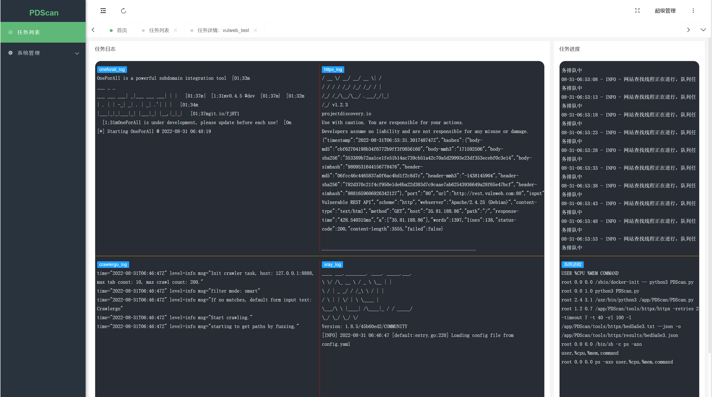
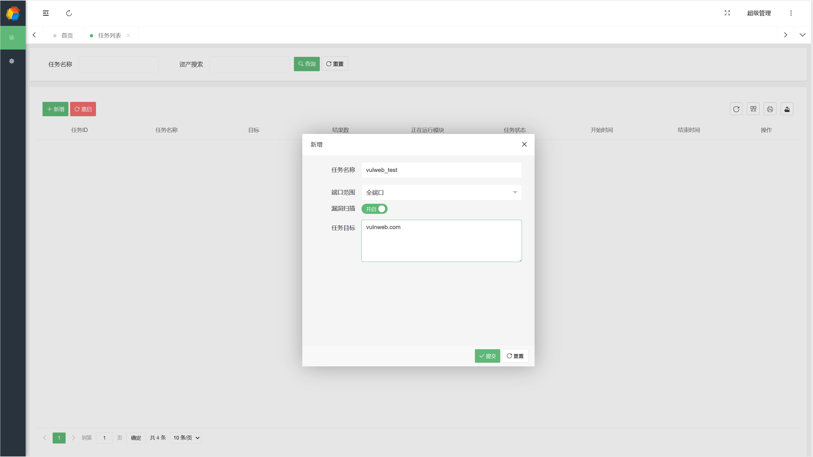
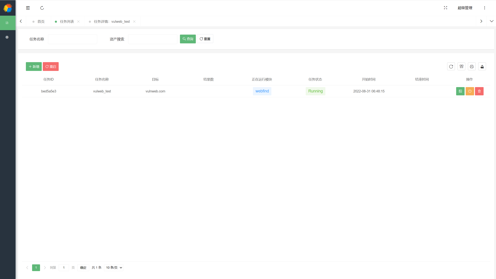
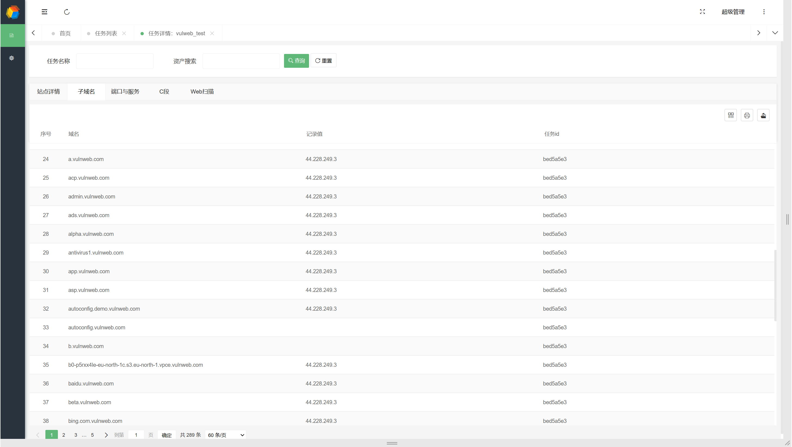
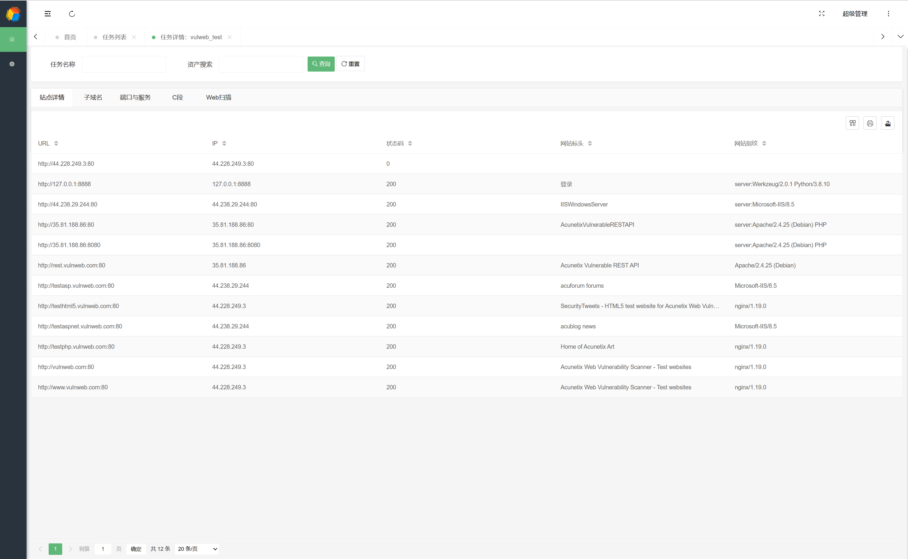
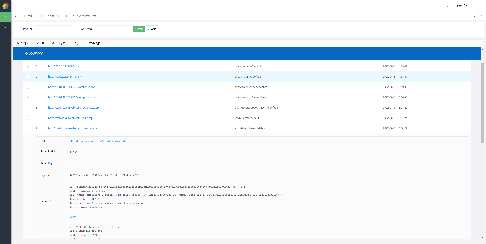

# PDScan

自动化资产搜集+漏扫平台

纯纯的胶水平台，借用了各个大师傅的优秀工具，完成了子域名查询（oneforall），ip端口扫描（scaninfo)，web站点存活探测（httpx），爬虫+漏扫（crawlergo+xray）的工作。

没有技术含量，但是可以省事

用sqlite做数据库，省去了配置数据库的烦恼

不会写前端，前端略丑。。。

有部分功能没有实现，比如资产的搜索啥的，小问题，可以自己导出excel然后筛选

## 安装

Linux Only

理论上Windows也行，但是配环境太麻烦懒得弄了

```bash
docker build . -t pdscan

docker run --init -d -p 8888:8888 pdscan
```

## 使用

默认密码：`admin/123456`



### 添加任务



查看任务状态



### 任务详情

均可导出csv，若想导出全部数据，先查询99999条（后端懒得写了）

子域名



存活站点



Xray扫描结果



## 项目所需的程序


Web框架 Pear Admin Flask
https://gitee.com/pear-admin/pear-admin-flask/tree/mini/

子域名探测 OneForall
https://github.com/shmilylty/OneForAll

端口扫描 scaninfo
扫的贼快，还比较准，想换成别的工具的师傅可以自行更换
https://github.com/redtoolskobe/scaninfo

Web存活探测 httpx
https://github.com/projectdiscovery/httpx

Web爬虫 crawlergo
https://github.com/Qianlitp/crawlergo

Web漏扫 xray
https://github.com/chaitin/xray
